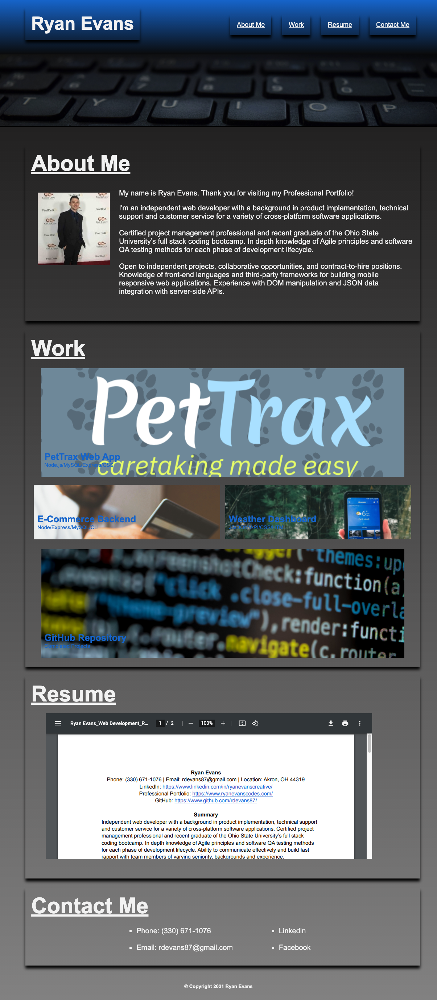

# RYAN EVANS: PROFESSIONAL PORTFOLIO 

# Summary

I've built this website using semantic HTML elements and advanced CSS properties to display my projects and experience while attending the Ohio State University's 24 week coding bootcamp. 

Application deployed at live URL: [My Professional Portfolio](https://rdevans87.github.io/RyanEvans_ProfessionalPortfolio/)

# About Me

Full stack web developer open to independent projects, collaborative opportunities, and contract-to-hire positions. open to independent projects, collaborative opportunities, and contract-to-hire positions. Knowledge of `front-end` languages and third-party frameworks for building mobile responsive web applications. 

Experience with `DOM` manipulation and `JSON` data integration with server-side `APIs`. Cloud application-platforms `Heroku` Command Line Interface `Git`, `MySQL` database creation and management, object-oriented programming `OOP`, object-relational mapping `ORM`, model-view-controller `MVC`

# Skills

• Programming Languages: `HTML5`, `CSS3`, `JavaScript ES6`

• Technologies/Frameworks: `Bootstrap`, `React.js`,`Node.js`, `jQuery`, `RESTful APIs`, `AJAX`, `CMS`, `MySQL`, `MongoDB`

• Product Development: `Pseudocode`, `Agile Principles`, `Scrum`, `Kanban`,   `Mobile First`, `Wireframe`

# Work

### PetTrax  
GitHub: https://github.com/rdevans87/pettrax 
Deployed: https://secret-coast-15963.herokuapp.com/ 
Summary:  A simple app for tracking your pets daily rhythms 
Tools: HTML, CSS, JavaScript, CLI, Node.js, MySQL, Express, Sequelize, Handlebars, Adobe PhotoShop, Bootstrap, Cloudinary, LucidChart, Heroku 
Role: Full-Stack Developer

### Weather Dashboard
GitHub: https://github.com/rdevans87/Weather-Dashboard-March-6-2021 
Deployed: https://rdevans87.github.io/Weather-Dashboard-March-6-2021/ 
Summary: Weather app that provides current and future weather forecasts in United States. 
Tools: HTML, CSS, JavaScript, API, Bootstrap, Font Awesome, Moment.js, HTTP requests. 
Role: Front-End Developer

### E-Commerce Backend App
GitHub: https://github.com/rdevans87/ORM-ECommerce-BackEnd 
Deployed: https://rdevans87.github.io/ORM-ECommerce-BackEnd/ 
Summary: Backend of an E-Commerce site using HTTP requests to modify inventory.<b>
Tools: Node.js, CLI, MySQL, RESTful API, Express.js, Sequelize 
Role: Back-End Developer  

# Resume

[Ryan Evans Resume](Assets/docs/ryanevans_resume.pdf) 

# Contact Me

 Email: <a href="mailto:rdevans87@gmail.com">rdevans87@gmail.com</a>

 Github: <a href="https://github.com/rdevans87">rdevans87</a>

 LinkedIn: <a href="https://www.linkedin.com/in/ryanevanscreative/">Ryan Evans</a>

# Mock Up

[MIT LICENSE](/Users/ryanevans/LICENSE.txt)